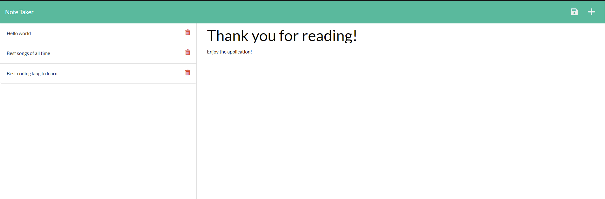

# W11-EXPRSS-NOTES
## Description
This application was made to enable the ability to be able to write and access notes for daily reminders, lists or general note taking.

## Installation
In order to be able to run the app after being cloned you need to run, using node
```
npm i
```
Then to run it you can use
```
node server.js
```

## Screenshots of Application

 
## GitHub
If you want to vist my [GitHub](https://github.com/Jamlit37) or the [GitHub repository](https://github.com/Jamlit37/W11-EXPRSS-NOTES) click the links

## Heroku
For a live application please visit my page on [Heroku](https://hidden-dusk-08673.herokuapp.com/)